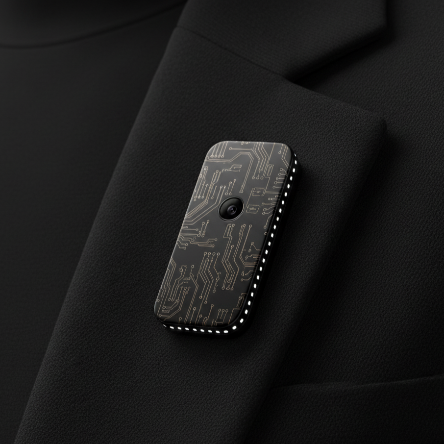

# aurintex: A Manifesto for a Privacy-First, Open Core AI Companion

**Status:** Concept phase. We are gathering feedback and building a community of early adopters for our YC application.

---

## The Opportunity: Unlocking AI's Potential Through Trust

The true potential of "always-on" AI is to act as a personal "Jarvis" or "Coach"—an agent that understands our real-world context and proactively helps us solve problems, learn, and improve.

But this future requires **absolute trust**.

The default 'Cloud-First' model fundamentally limits this potential. When we are asked to send our entire life-stream to a server just to get assistance, we hesitate. The technology remains a simple tool, not a true companion, because the foundation of trust is missing.

## The Mission: To Build the Foundation for Trustworthy AI

Our mission is to build the foundation of trust *required* to unlock this future. We are building a **wearable AI device** (concept name: "Companion") based on three non-negotiable principles:

### 1. Principle: Fully Functional Offline
The core AI—understanding audio and video—runs 100% on the device. Nothing leaves the device unless you explicitly command it to. This is the technical *proof* of the privacy promise.

### 2. Principle: The 'Purpose-Driven Filter'
The device is "deaf and blind" by default. This privacy-first architecture is *also* what makes it so powerful and flexible. 

Only when *you* assign it a task (e.g., "Help me track my nutrition") does it activate a specific "Purpose-Driven Filter" to watch *only* for that context. This makes it a versatile tool, capable of solving many different problems, all while keeping you in total control.

### 3. Principle: The 'Open Core' Trust Model
"Trust me" is not a business model. The proof must be public.

* **Open Source:** The entire core that guarantees privacy --> the OS, the data-pipeline, will be open-source and verifiable.
* **Proprietary (Our 'Secret Sauce'):** Our business model will be as transparent as our code. **Our core commitment is that we will *never* sell your data.** Our revenue will come from selling the valuable hardware and software we build—not from monetizing your private life. The exact mix of what we sell (e.g., the hardware itself, proprietary AI models, or optional cloud services) is still being explored, but it will *always* align with this privacy-first mission.

---

## The Concept (Form Factor)

This is not just an essay. We are designing a discreet, low-power wearable device. The goal is for it to complement you, not define you.

---

## Who is behind this?

I'm Riccardo, a solo founder and developer.

I am building this because I truly believe this technology can be a profound force for good. A "Jarvis" for everyone, a personal coach, an agent that can help us solve everyday problems. But this future is *only* possible if we solve the trust problem at the source.

## Join the Mission

The landing page with more details on the full vision is here:
`https://www.aurintex.com/`

I am prepping my YC application (Deadline: Nov 10). The original HN launch failed due to my 0-day-old account, so this is the reboot.

I need your brutally honest feedback on this *approach*.

If this mission resonates with you, joining the waitlist is the **single most important metric** to prove that a truly trustworthy AI *must* exist.

**[Join the Community -> https://www.aurintex.com/](https://www.aurintex.com/)**